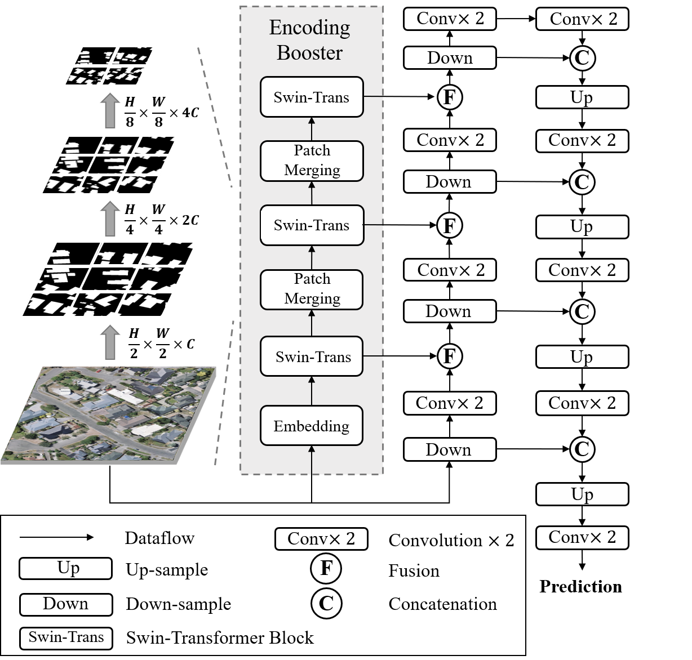
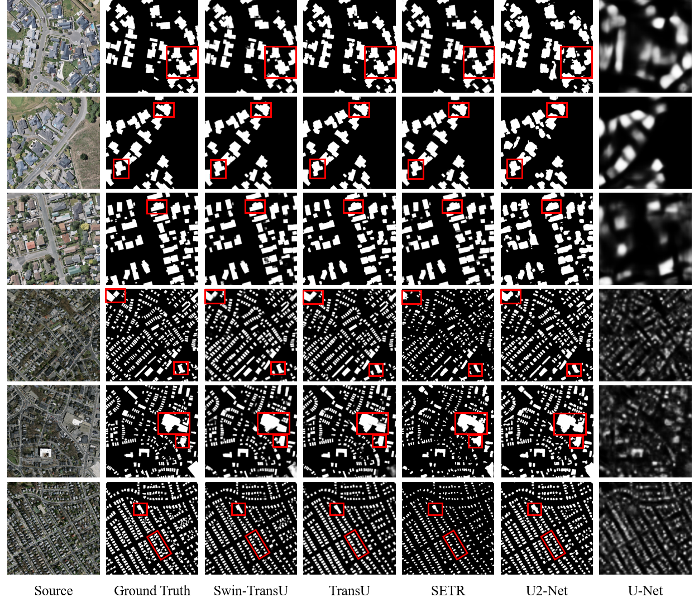
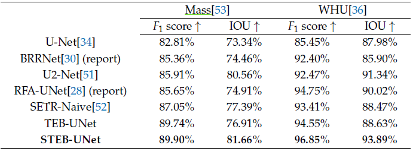
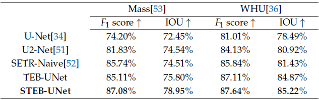

# A Swin Transformer-based Encoding Booster Integrated in U-shaped Network (STEB-UNet)
**Author:** Xiao Xiao, Wenliang Guo *, Rui Chen, Yilong Hui, Jianing Wang and Hongyu Zhao 

**Paper:** [A Swin Transformer-based Encoding Booster Integrated in U-shaped Network for Building Extraction](https://www.mdpi.com/2072-4292/14/11/2611)

## Abstract
Building extraction is a popular topic in remote sensing image processing. Efficient building extraction algorithms can identify and segment building areas to provide informative data for downstream tasks. Currently, building extraction is mainly achieved by deep convolutional neural networks (CNNs) based on the U-shaped encoder-decoder architecture. However, the local perceptive field of the convolutional operation poses a challenge for CNNs to fully capture the semantic information of large buildings, especially in high-resolution remote sensing images. Considering the recent success of the Transformer in computer vision tasks, in this paper, firstly we propose a shifted-window (swin) Transformer-based encoding booster. The proposed encoding booster includes a swin Transformer pyramid containing patch merging layers for down-sampling, which enables our encoding booster to extract semantics from multi-level features at different scales. Most importantly, the receptive field is significantly expanded by the global self-attention mechanism of swin Transformer, allowing the encoding booster to capture the large-scale semantic information effectively and transcend the limitations of CNNs. Furthermore, we integrate the encoding booster in a specially designed U-shaped network through a novel manner, named the Swin Transformer-based Encoding Booster- U-shaped Network (STEB-UNet), to achieve the feature-level fusion of local and large-scale semantics. Remarkably, compared with other Transformer-included networks, the computational complexity and memory requirement of STEB18 UNet are significantly reduced due to the swin design, making the network training much easier. Experimental results show that STEB-UNet can effectively discriminate and extract buildings of different scales and demonstrates higher accuracy than the state-of-the-art networks on public datasets.

## Architecture 

## Demo

## Comparsion
### Experimental results of different methods on WHU and Massachusetts datasets.

### The transfer learning experiment of different methods on WHU and Massachusetts datasets.

## Citation
@article{xiao2022swin,
  title={A Swin Transformer-Based Encoding Booster Integrated in U-Shaped Network for Building Extraction},
  author={Xiao, Xiao and Guo, Wenliang and Chen, Rui and Hui, Yilong and Wang, Jianing and Zhao, Hongyu},
  journal={Remote Sensing},
  volume={14},
  number={11},
  pages={2611},
  year={2022},
  publisher={Multidisciplinary Digital Publishing Institute}
}
